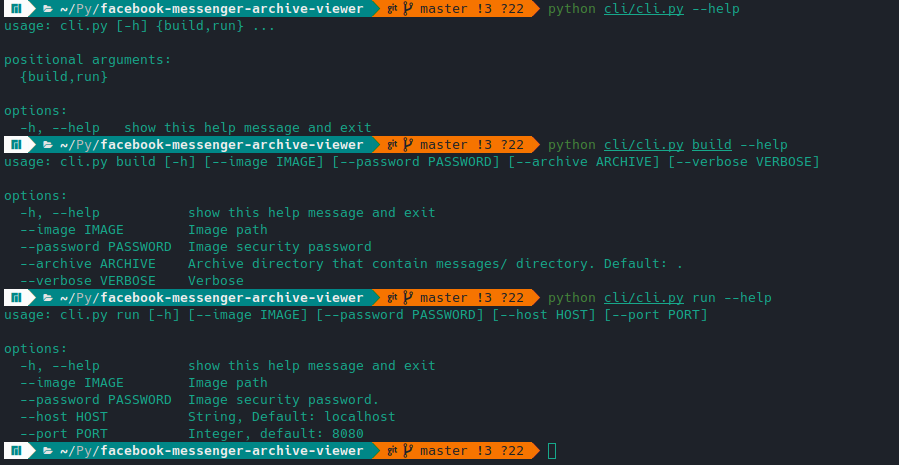
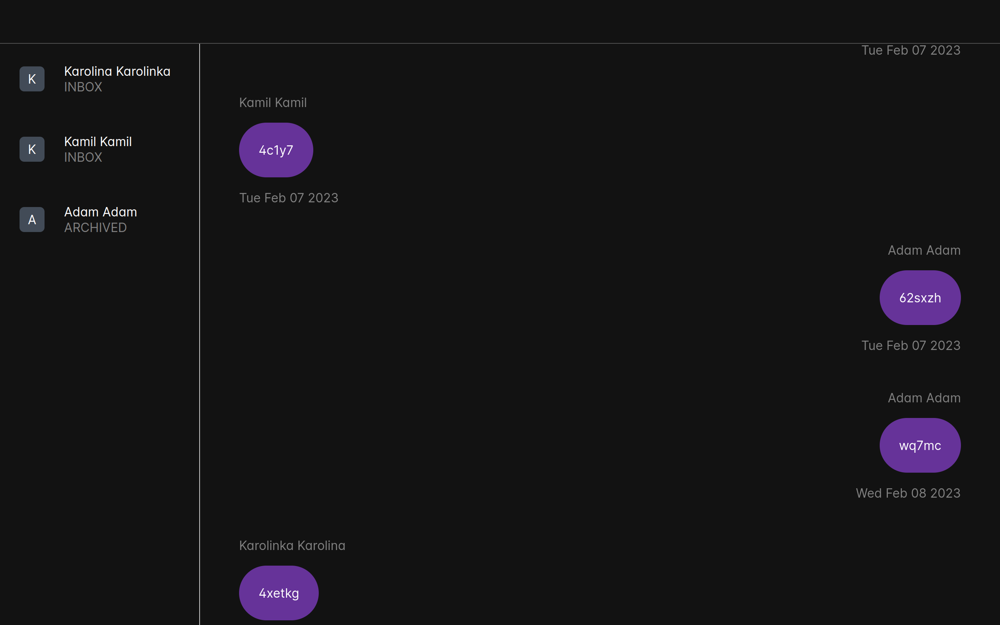

# facebook-messenger-archive-viewer

A simple CLI application written in **Python**, **Flask** and **SQLAlchemy**. 
You can use [facebook-messenger-archive-viewer](https://www.github.com/kacperfaber/facebook-messenger-archive-viewer).

Of course, it's not finished.

Kacper Faber